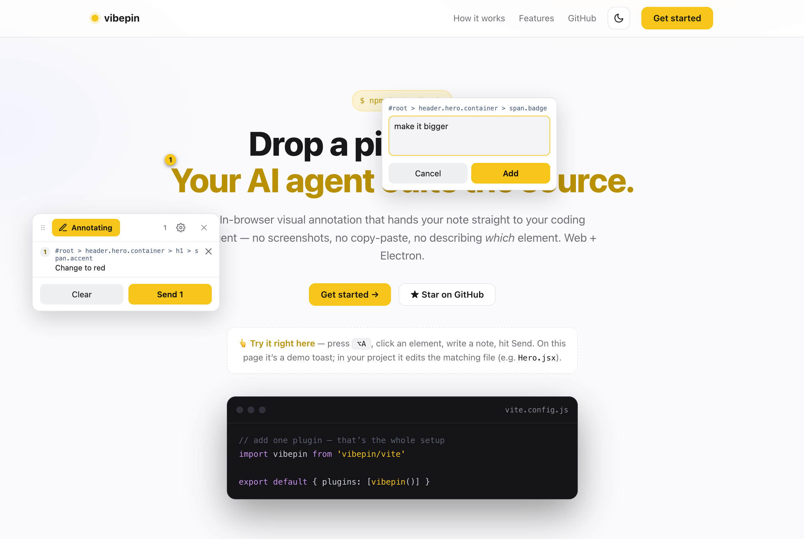
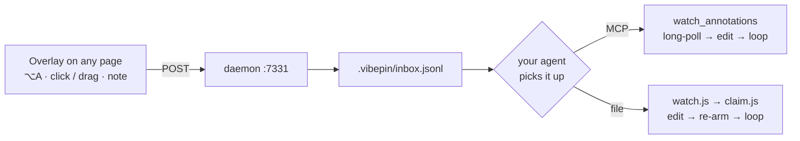

# vibepin

**Drop a pin on any UI, write what to change — your AI coding agent edits the source.**

[](https://yiwang3.github.io/vibepin)

In-browser visual annotation → local inbox → your agent picks it up and applies the change.
No screenshots, no copy-paste, no describing *which* element. Works on any Chromium page —
a web dev server **or** an Electron renderer — with React component + `file:line` detection.

- **Pin** an element or **drag a box** over a region, type a note, hit **Send**.
- Your agent drains the queue and edits the right file (React → component name + source line).
- Two pickup modes: a **zero-dep file watcher**, or an **MCP** `watch_annotations` tool.
- Fully local. No cloud, no account, no API key.

Works with **Claude Code** out of the box; **Codex**, **Cursor**, and **Antigravity**
via `vibepin init --agent <name>` or the MCP tools — any MCP-capable agent, really.

> 🌐 **Live demo** (press ⌥A right on the page): https://yiwang3.github.io/vibepin · ▶ [watch the demo](https://yiwang3.github.io/vibepin/demo.mp4)
> 📖 Chinese quickstart: [GETTING_STARTED.md](GETTING_STARTED.md)

## Quick start

### A. Try it (bundled examples)

```bash
git clone https://github.com/YIWANG3/vibepin
cd vibepin/examples/react-vite     # or web-vite / electron
npm install
npm run dev                        # opens a dev server (Electron: a window) with the overlay
```

1. Open the printed URL. Press **⌥A** (Option+A), click an element (or drag a box), type a note, hit **Send**.
2. Install the Claude Code command once, then restart Claude Code:
   ```bash
   npx vibepin init               # adds the /vpin slash command
   ```
3. In a Claude Code session **in that folder**, run **`/vpin`**. It watches the inbox and
   edits the right file every time you Send — React annotations even carry the component
   name + `file:line`.

### B. Use it in your own project

1. **Install:** `npm i -D vibepin`
2. **Inject the overlay** (dev only — pick one):
   - **Vite (web / React)** — in `vite.config.js`:
     ```js
     import vibepin from 'vibepin/vite';
     export default defineConfig({ plugins: [vibepin()] }); // after react()
     ```
   - **Next.js** — `withVibepin(nextConfig)` + a dev-only `<Script>` — see [adapters/nextjs.md](adapters/nextjs.md).
   - **Electron** — see [adapters/electron.md](adapters/electron.md).
   - **Anything else** — run `npx vibepin daemon`, then add
     `<script src="http://127.0.0.1:7331/annotate.js"></script>` to your dev HTML.
3. **Install the command:** `npx vibepin init` (once), then restart Claude Code.
4. Add `.vibepin/` to your `.gitignore`.
5. Start your dev server, open Claude Code in the project root, run **`/vpin`**, then annotate in the browser.

---

Below: architecture & reference.



The agent gets the annotation in one of two interchangeable ways — an **MCP**
`watch_annotations` long-poll, or a **zero-dep file watcher** (`watch.js` → `claim.js`).

The architecture constraint this respects: an MCP server / browser extension can
**never push** an agent turn — the agent (client) must initiate. So the wake is
always agent-side: either it parks in `watch_annotations` (MCP long-poll, same
pattern as vibe-annotations) or in a background `watch.js` that exits on change
and lets the harness re-invoke the agent. Same loop, two transports.

## Distribution (pick per target)

| Target | How to inject the overlay |
|---|---|
| **Owned web project** (Vite) | `devDependency` → `import vibepin from 'vibepin/vite'` — auto-spawns daemon + injects script in dev |
| **Next.js** | `withVibepin(nextConfig)` + a dev-only `<Script>` in your layout — see [adapters/nextjs.md](adapters/nextjs.md) |
| **Electron app** | dev-only `executeJavaScript` loader + optional pixel-perfect capture — see [adapters/electron.md](adapters/electron.md) |
| **Any page / not yours** | `<script src="http://127.0.0.1:7331/annotate.js">`, a bookmarklet, or a thin browser extension that injects the same line |

The overlay (`core/annotate.js`) is one file, identical everywhere. Only the
injection vector differs.

## Standalone daemon (no project)

```bash
npx vibepin daemon                    # serves overlay + demo + collects annotations
open http://127.0.0.1:7331/           # demo page; press ⌥A, click, type, Send
```

## Runnable examples

- [examples/web-vite](examples/web-vite) — plain browser project; integration is one
  Vite plugin that auto-spawns the daemon and injects the overlay. `npm install && npm run dev`.
- [examples/react-vite](examples/react-vite) — React app; annotations carry the
  **component name + source file:line** (not just a selector). `npm install && npm run dev`.
- [examples/nextjs](examples/nextjs) — Next.js (App Router); `withVibepin` auto-starts the
  daemon, overlay injected via a dev `<Script>`. `npm install && npm run dev`.
- [examples/electron](examples/electron) — Electron app; main.js injects the overlay
  in dev and exposes `capturePage` for pixel-perfect crops. `npm install && npm run dev`.

## Two gestures — no mode switch

- **Click** an element → element annotation. Hover-highlights first. On React dev
  builds the payload includes `component` + `source` (from the fiber's `_debugSource`,
  or a `data-source` attribute fallback for React 19 / inspector plugins).
- **Drag** a box (>5px) → region annotation. Captures the box `rect` and the
  `elements` (with components) inside it. For "this whole row is cramped" feedback
  that isn't a single node.

Shortcuts: **⌥A / Alt+A** toggle · **Esc** exit.

## The Claude Code loop

### Recommended: the `/vpin` command

`/vpin` is a Claude Code slash command — it lives in Claude Code's config, not in
node_modules, so npm can't install it. A CLI does:

```bash
npx vibepin init     # writes ~/.claude/commands/vpin.md — then restart Claude Code
```

Then in any project, run **`/vpin`**. It parks a background file watcher and hands
control back to you; each time you Send annotations it wakes, edits the right files,
and re-arms. **Zero idle token cost** — the waiting happens in a shell process, not
the model — and you can keep typing other requests in the same window.

Under the hood it loops `vibepin watch` (blocks until the inbox grows) → `vibepin claim`
(drains + archives as JSON) → edit → re-arm.

### Alternative: MCP watch mode

Register the daemon's `/mcp` and tell Claude Code **“start watching vibepin”**:

```bash
claude mcp add --transport http vibepin http://127.0.0.1:7331/mcp
```

Tools: `watch_annotations` (long-poll), `list_annotations`, `resolve_annotation`.
Note: the agent **polls**, so it keeps spending tokens while idle — fine for
hands-free, worse for cost. Needs `npm install` (pulls `@modelcontextprotocol/sdk`).

Both modes read the same `.vibepin/inbox.jsonl`.

## Other agents (Codex · Cursor · Antigravity)

The loop is agent-agnostic — only the wiring differs. `init` writes that agent's
`/vpin` command/prompt (the token-cheap file-watcher loop) and prints its MCP
snippet as the alternative:

```bash
npx vibepin init --agent codex        # ~/.codex/prompts/vpin.md
npx vibepin init --agent cursor       # .cursor/commands/vpin.md (run in your project)
npx vibepin init --agent antigravity  # MCP-only — prints the snippet to register
npx vibepin init --agent all          # all of the above + Claude Code
```

Per-agent details: [adapters/codex.md](adapters/codex.md) ·
[adapters/cursor.md](adapters/cursor.md) · [adapters/antigravity.md](adapters/antigravity.md).
All transports read the same `.vibepin/inbox.jsonl`.

## Overlay UX

- **Alt+A** toggle. Hover highlights; the tag shows `tag#id.class`.
- Click → popup with the resolved CSS selector → type a note → **Add** (or ⌘/Ctrl+Enter).
- Bottom-right panel batches them; **Send** POSTs the batch. **Esc** exits.
- **Copy** serializes the batch to a plain-text block (component + `file:line`, note,
  region elements, page URL) and puts it on your clipboard — paste it into *any* agent
  (Claude Code, Codex, Cursor, ChatGPT, …). **Zero setup**: no daemon pickup, no watch
  loop, no MCP — the lowest-friction, fully non-invasive way to hand off.
- Each annotation carries: `selector`, `rect`, truncated `outerHTML`, a curated
  `getComputedStyle` subset, `note`, `url`, and (if `window.__vibepinCapture` exists) a screenshot.

## Notes

- Daemon binds `127.0.0.1` only. Inbox path is fixed at startup so the watcher is unambiguous.
- One daemon serves many pages; point it at the inbox of whichever repo Claude Code is editing.
- No agent self-verification by design — you stay the aesthetic judge; the loop only removes the handoff friction.
